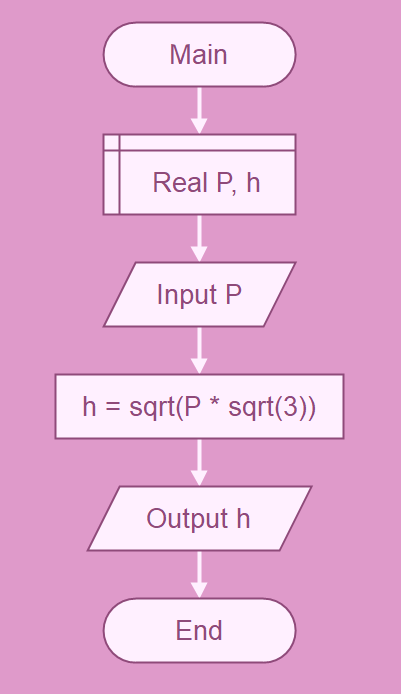

# Домаћи задатак из Техничке документације 

## Задатак

Програм који на основу унете површине једнакостраничног троугла P израчунава 
висину h.

$h = \sqrt{P\sqrt{3}}$

### Алгоритамска шема 



## Решење 
```cs
using System;
namespace ConsoleApp3
{
    internal class Program
    {
        static void Main(string[] args)
        {
            Console.WriteLine("Unesi povrsinu jednakostranicnog trougla:");
            double.TryParse(Console.ReadLine(), out double P);
            double a = Math.Sqrt((4 * P) / Math.Sqrt(3));
            double h = (Math.Sqrt(3) / 2) * a;

            Console.WriteLine("Visina jednakostranicnog trougla je " + h);
        }
    }
}

```
### Тест примери

Тест пример 1:

``` text
Unesi povrsinu jednakostranicnog trougla:
65
Visina jednakostranicnog trougla je 10.6105279082606

C:\Users\Nensi\source\repos\ConsoleApp3\ConsoleApp3\bin\Debug\ConsoleApp3.exe (process 16036) exited with code 0 (0x0).
To automatically close the console when debugging stops, enable Tools->Options->Debugging->Automatically close the console when debugging stops.
Press any key to close this window . . .
```

Тест пример 2:

``` text
Unesi povrsinu jednakostranicnog trougla:
105
Visina jednakostranicnog trougla je 13.4857456150831

C:\Users\Nensi\source\repos\ConsoleApp3\ConsoleApp3\bin\Debug\ConsoleApp3.exe (process 16348) exited with code 0 (0x0).
To automatically close the console when debugging stops, enable Tools->Options->Debugging->Automatically close the console when debugging stops.
Press any key to close this window . . .
```
### Објекти

| Редни број | Променљива | Тип променљиве |
| ---------- | ---------- | -------------- |
| 1.         | `P`        | `double`       |
| 2.         | `a`        | `double`       |
| 3.         | `h`        | `double`       |
